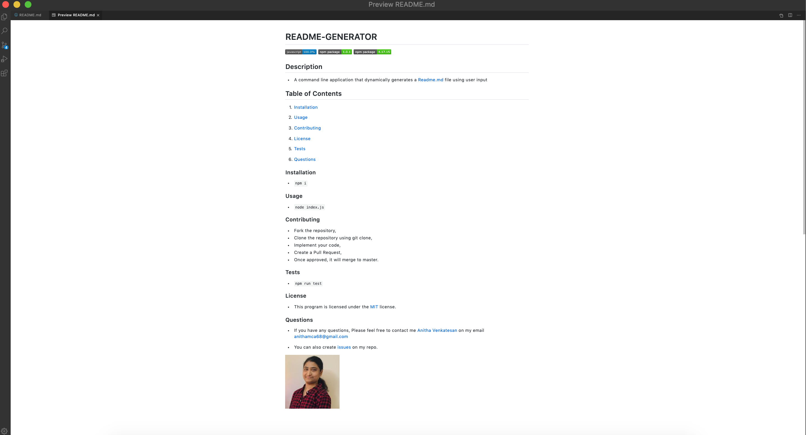
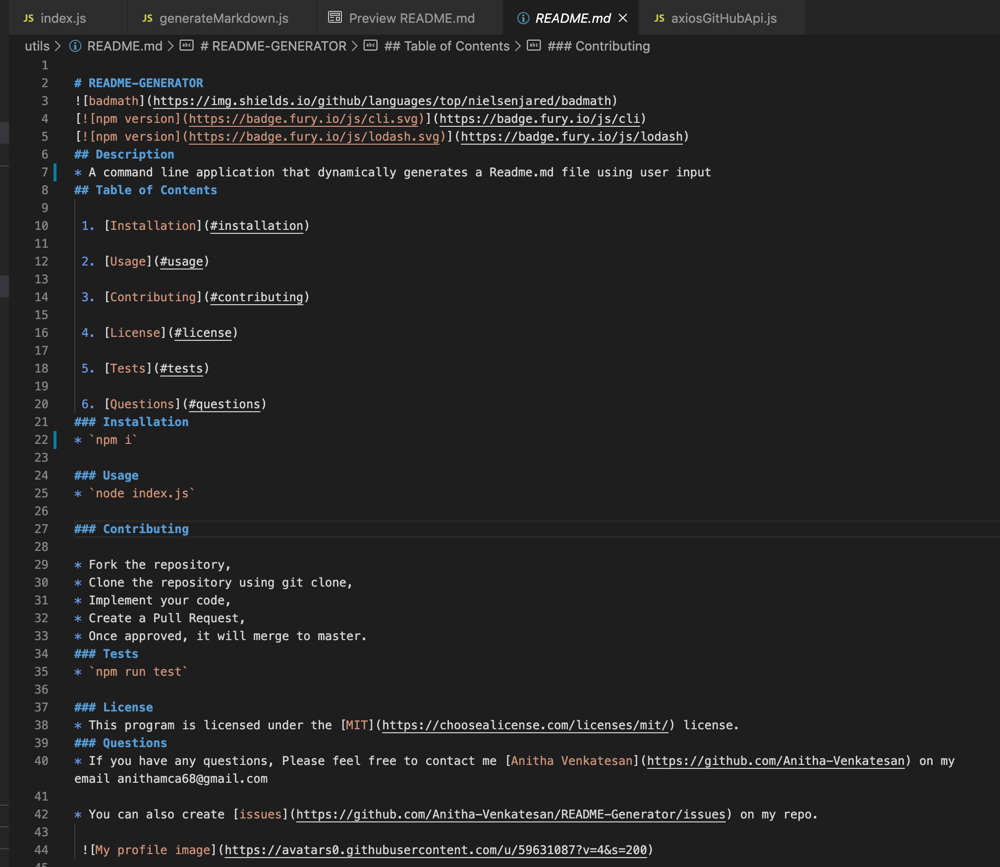
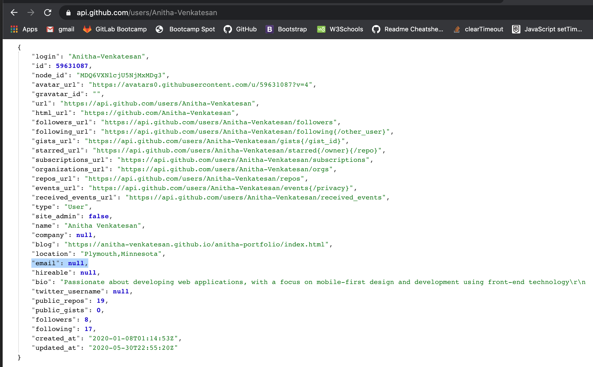

# README-GENERATOR

## Description
* A command line application that dynamically generates a Readme.md file using user input
* Getting GitHub infomation such as name,repository name and email to generate the readme for the user for a project
* Installing npm packages for node dependencies such as inquirer for prompting user input 
* Used GitHub APIs to get the profile picture, repository name ,repository issues link and email id    
 
### Installation
Steps to install the dependencies for the node npm packages
* `npm init` 
* `npm i`
* `npm i lodash`
* `npm i axios`
* `npm i inquirer`

### Usage
* 
* git clone `git@github.com:Anitha-Venkatesan/README-Generator.git`
* `cd README-Generator`
* Open index.js in Command Line Terminal using the command `node index.js`

## Screenshots 
* 

* 

## Demo Link
* [DEMO](Screenshots/Demolink.mov)

### APIS used 
* https://api.github.com/users/Anitha-Venkatesan
* https://api.github.com/repos/Anitha-Venkatesan/README-Generator

### Issues
* Have my email id added on the GitHub acccount, But when getting email through the axios API call, it is showing "null" 
Below is the screenshot for the reference :

            
            
            
            
            
            
            
      
